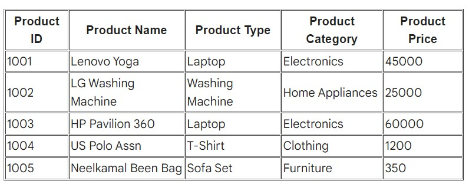

# AlgoDomain-Solutions-Technical-Task-

Create RESTfull API using any of the bellow technology 

 ***  Swagger Document for API(http://localhost:8080/swagger-ui/#/product-controller)***
 
Java 8  with Spring Boot Or 
Node and ExpressJs
__________________________________________________________________________________________________

Create Product entity and save below product in database (use any database of your choice).

You should be able to perform CRUD operations on Product entity to add/update/delete products.

getProducts method will calculate the final price of each product based on discount and other charges table . 

Optionally add Angular/React UI for adding and removing products within the cart.
______________________________________________________________________________________________________

___________________________________________________________________________________________________

Disconts, Tax and Delivery charges (Per Category)

 

______________________________________________________________________________________________________

get Products JSON output as given below.

{

    “productId”: “1001”,

    "name": "Lenovo Yoga",

    "productType": "Laptop",

    "category": "Electronics",

    "basePrice": "45000.00",

    "discount": 6750.00,

    "charges": {

      "gst": "6885.00",

    "delivery": "350.00"
    
     },
  
    "finalPrice": "45485.00"
  
}
_____________________________________________________________________________________________________________________________________
output

__________________________________________________________________________________________________________________________________________________________

Final price is calculated excluding discounts and including GST and Delivery Charges which are different for each product categories.
